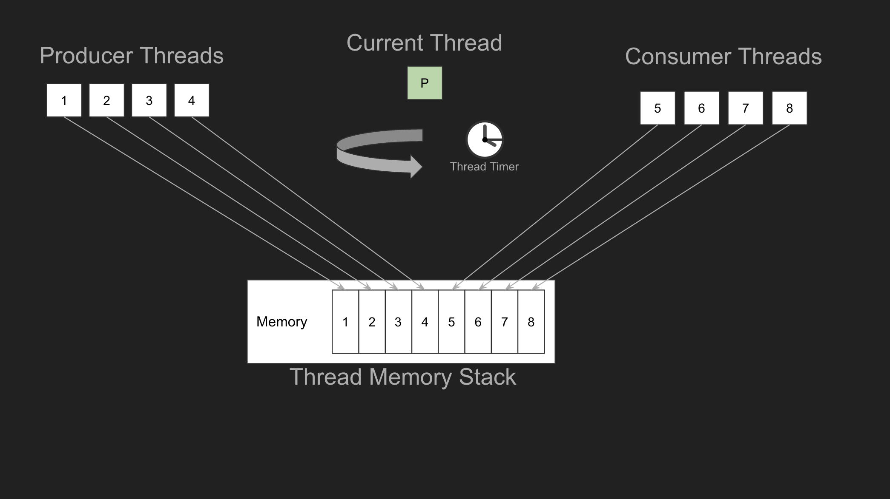

# Operating-Systems-Projects
Operating Systems Projects, written in C

* *Server-Client Connection Methods*
Implement multi-client support with thread pools and forking.

* Kernel Level Threads and Locks*
Implement a simple kernel-level thread module and locks with conditions

* *Virtual Memory*
Implement virtual memory tables and memory translation module

* *Filesystem*
Implement a simple filesystem module similar to the linux filesystem
